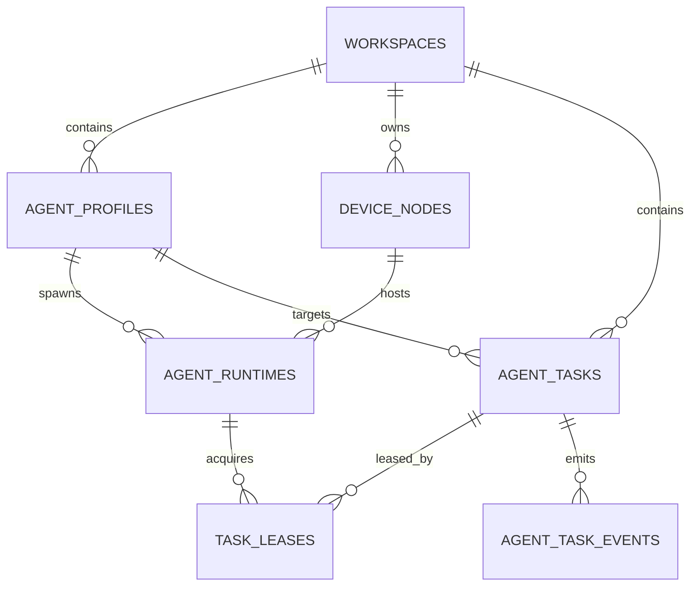

# MemHub Agent Profile / Runtime 分层设计

## 1. 文档目的

本文档用于回答一个关键建模问题：

> Mission Control 中的 Agent，到底应该表示“规则与记忆配置”，还是“实际执行实例”？

结论是：

- 不应二选一
- 需要拆成两层模型
- Mission Control 主视角应以“实际执行实例”作为核心展示对象

## 2. 结论摘要

MemHub 中的 Agent 应拆成两类实体：

- `AgentProfile`
  - 逻辑 Agent
  - 负责“它是谁、按什么规则工作”
- `AgentRuntime`
  - 执行实例
  - 负责“它现在在哪、是否在线、正在执行什么”

任务分配时，用户选择 `AgentProfile`；系统调度时，平台把任务路由到一个可用的 `AgentRuntime`。

因此，Mission Control 应主要展示：

- 哪些 Runtime 在线
- 哪些 Runtime 正在执行
- 哪些任务排队
- 哪些 Workflow 被卡住

而不是只展示“逻辑 Agent 名称列表”。

## 3. 为什么不能只保留一种 Agent

## 3.1 如果 Agent 只表示规则和记忆

好处：

- 规则模型简单
- 容易管理知识库、默认规则、记忆策略

问题：

- 无法描述一台设备上跑了几个实例
- 无法区分哪个 Agent 在线、哪个掉线
- 无法表达同一个逻辑 Agent 在多设备并发执行
- 无法准确回答 Mission Control 最关键的问题：谁在干活

结论：

> 这种建模适合配置中心，不适合控制平面。

## 3.2 如果 Agent 只表示实际执行实例

好处：

- 运行态最直观
- 调度、心跳、日志、故障恢复都容易建模

问题：

- 规则被分散到不同实例，难统一管理
- 同一个角色的多个实例缺少共同配置来源
- 很难做版本升级、灰度发布、规则回滚
- 用户创建任务时，不知道该选哪个实例

结论：

> 这种建模适合执行平面，不适合规则平台。

## 4. 推荐分层

## 4.1 AgentProfile

`AgentProfile` 表示一个逻辑 Agent 角色。

它负责定义：

- 名称
- 描述
- 所属 Workspace
- 默认知识库范围
- 规则集
- 记忆策略
- 技能白名单
- 工具白名单
- 输出风格
- 调度约束
- 版本号
- 状态（草稿、启用、冻结、废弃）

它不直接表示某个正在运行的进程。

### 典型示例

- Android Reviewer
- API Integrations Operator
- Design System Agent
- Security Audit Agent

这些对象更像“岗位定义”或“角色模板”。

## 4.2 AgentRuntime

`AgentRuntime` 表示某个 `AgentProfile` 的一个在线执行实例。

它负责定义：

- 绑定的 `profile_id`
- 所在 `device_node_id`
- 运行进程标识
- 版本
- 状态（online / busy / idle / offline / draining）
- 当前租约数量
- 最大并发
- 最近心跳
- 最近错误
- 启动时间
- 上线方式（daemon / sdk / webhook-worker）

它代表一个真实可调度的执行单元。

### 典型示例

- `Android Reviewer` on `mac-mini-01`
- `Android Reviewer` on `dev-mbp-liam`
- `Security Audit Agent` on `server-worker-03`

## 4.3 DeviceNode

为了支撑“公司所有设备接入”，还需要独立设备模型。

`DeviceNode` 用来描述：

- 设备名
- 主机标识
- 所属用户/团队
- 操作系统
- 架构
- CPU / 内存能力
- 网络区域
- 设备状态
- 最后心跳
- 可运行标签

这样 Mission Control 才能真正看到“这台机器上有哪些 Agent 实例在工作”。

## 5. 推荐数据模型

## 5.1 核心表

建议新增或重构为以下实体：

- `agent_profiles`
- `agent_profile_knowledge_bases`
- `agent_profile_rules`
- `agent_profile_memories`
- `device_nodes`
- `agent_runtimes`
- `runtime_capabilities`
- `task_leases`

现有实体继续保留并调整：

- `workspaces`
- `workspace_members`
- `workspace_knowledge_bases`
- `agent_tasks`
- `agent_task_events`
- `workflow_templates`
- `workflow_runs`

## 5.2 agent_profiles

建议字段：

- `id`
- `workspace_id`
- `name`
- `slug`
- `description`
- `status`
- `default_prompt`
- `memory_policy`
- `tool_policy`
- `skill_policy`
- `default_concurrency`
- `routing_mode`
- `version`
- `created_by_id`
- `created_at`
- `updated_at`

说明：

- 当前代码里的 `agents` 更接近这个层
- 后续应把现在 `agents` 的“规则型信息”迁移到 `agent_profiles`

## 5.3 device_nodes

建议字段：

- `id`
- `workspace_id`
- `name`
- `hostname`
- `device_type`
- `os_name`
- `arch`
- `cpu_cores`
- `memory_mb`
- `labels_json`
- `status`
- `owner_user_id`
- `last_heartbeat_at`
- `created_at`
- `updated_at`

## 5.4 agent_runtimes

建议字段：

- `id`
- `workspace_id`
- `profile_id`
- `device_node_id`
- `runtime_key`
- `launch_mode`
- `status`
- `current_load`
- `max_concurrency`
- `last_heartbeat_at`
- `last_error`
- `started_at`
- `stopped_at`
- `version`
- `metadata_json`

说明：

- 一个 `AgentProfile` 可以对应多个 `AgentRuntime`
- 一个设备上也可以同时跑多个 Runtime

## 5.5 agent_tasks

建议从“指向 agent_id”调整成“同时指向 profile 和 runtime”：

- `target_profile_id`
- `assigned_runtime_id`

其中：

- `target_profile_id`：业务上希望由哪个逻辑 Agent 处理
- `assigned_runtime_id`：最终由哪个运行实例领取执行

## 5.6 task_leases

建议新增任务租约表，字段包括：

- `id`
- `task_id`
- `runtime_id`
- `lease_token`
- `leased_at`
- `expires_at`
- `released_at`
- `status`

这样可以支持：

- 任务领取
- 租约续期
- 运行实例掉线后自动回收

## 6. 实体关系图



## 7. 调度模型

## 7.1 任务创建

用户创建任务时，不直接选择 Runtime，而是选择：

- Workspace
- AgentProfile
- 任务输入
- 可选知识库上下文
- 优先级
- 截止时间

## 7.2 调度匹配

调度器根据以下条件筛选可执行 Runtime：

- `runtime.profile_id == task.target_profile_id`
- Runtime 在线且未被 drain
- Runtime 当前负载小于最大并发
- DeviceNode 可用
- Runtime 对任务目标知识库有权限
- Runtime 所在设备满足能力标签要求

## 7.3 领取与执行

流程建议：

1. 任务入队
2. Runtime 拉取任务
3. 平台创建 `task_lease`
4. Runtime 周期性续租
5. 执行完成后回写结果
6. 平台释放租约并更新任务状态

## 7.4 故障恢复

如果 Runtime 心跳超时：

- 将其状态改为 `offline`
- 回收其未完成租约
- 把对应任务重新放回队列
- 记录 `agent_task_event`

## 8. Mission Control 改版方案

## 8.1 设计原则

基于 `ui-ux-pro-max` 的控制台信息架构，Mission Control 应遵循：

- 主视角展示运行态，而不是配置态
- 高频动作优先放在任务区和运行区
- 规则和记忆编辑收敛到 Profile 详情页，而不是控制台首页
- 所有状态过滤器和关键操作保证 44px 触达区
- 颜色和密度保持当前深色控制台风格一致

## 8.2 页面层级

### 一级：Workspace 首页

展示：

- Workspace 卡片
- 每个 Workspace 的在线 Runtime 数
- 排队任务数
- 失败任务数
- 最近活跃时间

操作：

- 新建 Workspace
- 进入某个 Workspace 控制台

### 二级：Workspace 控制台

建议三栏：

- 左侧：`Runtime Fleet`
- 中间：`Mission Queue / Workflow Runs`
- 右侧：`Run Feed / Runtime Detail`

### 三级：Profile 配置页

展示：

- 规则
- 默认知识库
- 记忆策略
- 工具权限
- Prompt 模板
- 发布历史

操作：

- 新建 / 编辑 / 发布 Profile
- 灰度发布
- 回滚版本

## 8.3 Workspace 控制台布局

### 左侧：Runtime Fleet

展示真实运行实例：

- Runtime 名称
- 关联 Profile
- 所在设备
- 当前状态
- 当前负载 / 最大并发
- 最近心跳
- 最近错误摘要

支持筛选：

- online
- busy
- idle
- offline
- draining
- 按设备
- 按 Profile

### 中间：Mission Queue / Workflow

展示：

- 任务状态列：queued / leased / running / completed / failed / blocked
- Workflow 实例列表
- 当前任务所属 Profile
- 当前任务被哪个 Runtime 领取
- 重试次数 / 租约时间 / SLA

支持动作：

- 新建任务
- 启动 Workflow
- 取消任务
- 重新排队
- 人工改派

### 右侧：Run Feed / Detail

展示：

- 任务事件流
- Runtime 心跳记录
- 最新结果
- 错误日志
- 规则版本
- 访问过的知识库

## 8.4 关键页面切换

### 任务创建页

不再“直接创建到 Agent 实例”，而是：

- 选择 `AgentProfile`
- 选择可选知识库上下文
- 指定运行约束
  - 仅某类设备
  - 最小资源
  - 指定标签

### Runtime 详情抽屉

展示：

- 绑定的 Profile
- 当前设备
- 当前任务
- 历史执行记录
- 最近错误
- 版本号

动作：

- drain
- restart
- 临时禁用

### Profile 详情页

展示：

- 系统规则
- 知识库绑定
- 记忆策略
- 工具授权
- 发布记录
- 当前在线 Runtime 数

动作：

- 发布新版本
- 冻结
- 回滚

## 9. API 草案

## 9.1 Profile API

- `GET /api/mission-control/profiles`
- `POST /api/mission-control/profiles`
- `GET /api/mission-control/profiles/{id}`
- `PATCH /api/mission-control/profiles/{id}`
- `POST /api/mission-control/profiles/{id}/publish`
- `POST /api/mission-control/profiles/{id}/rollback`

## 9.2 Device API

- `GET /api/mission-control/devices`
- `POST /api/mission-control/devices/register`
- `POST /api/mission-control/devices/{id}/heartbeat`
- `PATCH /api/mission-control/devices/{id}`

## 9.3 Runtime API

- `GET /api/mission-control/runtimes`
- `POST /api/mission-control/runtimes/register`
- `POST /api/mission-control/runtimes/{id}/heartbeat`
- `POST /api/mission-control/runtimes/{id}/drain`
- `POST /api/mission-control/runtimes/{id}/shutdown`
- `GET /api/mission-control/runtimes/{id}`

## 9.4 Task API

- `GET /api/mission-control/workspaces/{id}/tasks`
- `POST /api/mission-control/workspaces/{id}/tasks`
- `GET /api/mission-control/tasks/{id}`
- `PATCH /api/mission-control/tasks/{id}`
- `POST /api/mission-control/tasks/{id}/requeue`
- `POST /api/mission-control/tasks/{id}/cancel`

### 建议的创建任务请求

```json
{
  "title": "生成 Android 代码审查报告",
  "summary": "扫描指定项目并输出整改建议",
  "target_profile_id": 12,
  "knowledge_base_id": 7,
  "priority": "high",
  "payload": {
    "repo": "git@github.com:company/mobile-app.git",
    "branch": "main"
  },
  "routing_constraints": {
    "device_labels": ["macos", "xcode"],
    "min_memory_mb": 8192
  }
}
```

## 9.5 Runtime Pull API

供常驻 Agent 或 Daemon 使用：

- `POST /api/mission-control/runtimes/{id}/poll`
- `POST /api/mission-control/tasks/{id}/lease/renew`
- `POST /api/mission-control/tasks/{id}/events`
- `POST /api/mission-control/tasks/{id}/result`
- `POST /api/mission-control/tasks/{id}/fail`

### 建议的 Poll 返回

```json
{
  "tasks": [
    {
      "task_id": 101,
      "lease_token": "lease_xxx",
      "target_profile": {
        "id": 12,
        "name": "Android Reviewer",
        "version": 3
      },
      "rules": {
        "prompt": "你是 Android Reviewer ...",
        "memory_policy": "workspace_shared",
        "tool_policy": ["git", "lint", "gradle"]
      },
      "knowledge_context": {
        "knowledge_base_ids": [7, 8]
      },
      "payload": {
        "repo": "git@github.com:company/mobile-app.git"
      }
    }
  ]
}
```

## 10. 与当前代码的映射建议

当前代码中的 `agents` 表更接近 `AgentProfile`，因为它承载了：

- 名称
- 描述
- 默认知识库
- 绑定用户
- 能力标签

建议改造路径：

### 第一阶段

- 保留现有 `agents`
- 将其语义改名为 `agent_profiles`
- 新增 `device_nodes` 与 `agent_runtimes`
- `agent_tasks` 新增 `target_profile_id` 和 `assigned_runtime_id`

### 第二阶段

- 将现有页面中的 Agent 列表切换为 Runtime 列表
- Profile 变成独立配置页
- 任务默认选择 Profile 而不是 Runtime

### 第三阶段

- 引入 Workflow 模板和租约
- Runtime 通过 Pull API 拉任务

## 11. 实施优先级建议

最合理的落地顺序是：

1. 先新增 `device_nodes`
2. 再新增 `agent_runtimes`
3. 再把任务从“绑定 Agent”改成“绑定 Profile + Runtime”
4. 再改造 Mission Control UI
5. 最后补 Workflow 模板和租约机制

如果顺序反过来，前端页面会建立在错误的抽象上，后续必须重构。

## 12. 一句话结论

MemHub 中的 Agent 不应只表示“规则对象”，也不应只表示“执行实例”。

正确做法是：

> 用 `AgentProfile` 管规则和记忆，用 `AgentRuntime` 管在线执行，用 Mission Control 主看 Runtime，用任务调度把两者连接起来。
