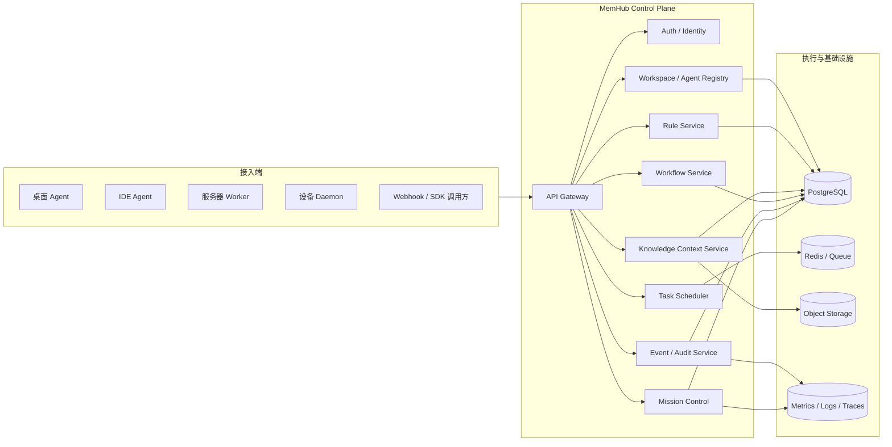
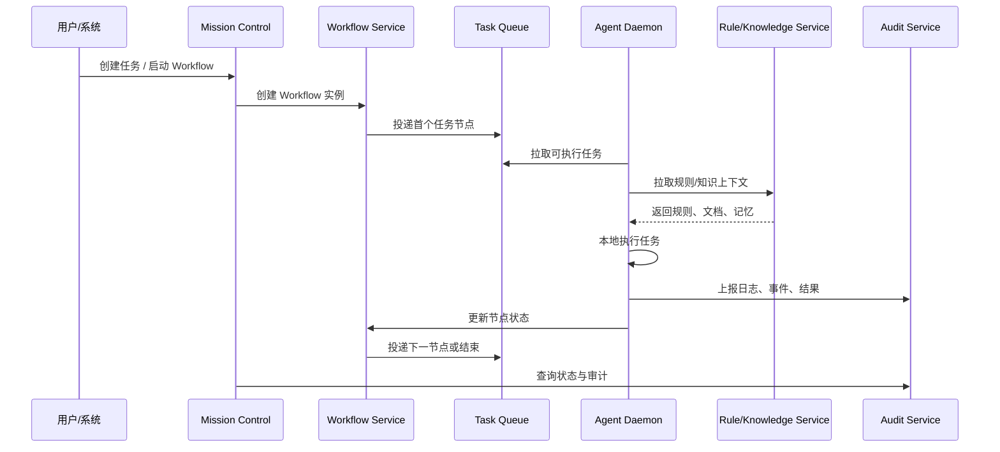

# MemHub v2：中心化 Agent 规则平台与控制平面

## 1. 文档目的

本文档用于明确 MemHub 的下一阶段定位：从“知识库 + Agent 辅助检索工具”升级为“公司内部 AI Agent 工作流基础服务”。

目标不是只做一个聊天产品或文档检索入口，而是做成公司内部统一的 Agent 控制平面，承载：

- Agent 规则中心
- Agent 注册与调度中心
- Workflow 编排与任务执行中心
- Agent 运行观测与审计中心
- 多设备、7x24 小时、多进程任务体系的底座

## 2. 目标定位

### 2.1 核心定位

MemHub 的核心定位调整为：

> 面向企业内部的中心化 Agent 规则平台（Agent Control Plane）。

它负责统一管理公司内部所有 Agent 的：

- 规则
- 身份
- 权限
- 知识上下文
- 工作流
- 任务执行
- 运行状态
- 审计记录

### 2.2 目标场景

MemHub 后续需要支撑以下场景：

- 公司内部不同团队创建独立 Workspace，隔离各自 Agent、知识库和任务流
- 各类 Agent 按统一协议接入，包括桌面 Agent、IDE Agent、服务器 Agent、自动化 Worker、常驻设备 Agent
- Agent 从 MemHub 拉取规则、知识上下文与待执行任务，并回写执行结果
- 任务可串成 Workflow，由多个 Agent 接力执行
- 每台设备上的 Agent 常驻运行，实现 7x24 小时、多进程、多任务并发执行
- 管理者通过 Mission Control 统一查看系统状态、任务流转、失败重试与人工介入点

### 2.3 非目标

当前阶段不把 MemHub 定义为：

- 单纯的聊天界面产品
- 单纯的 RAG 问答服务
- 单机本地 Agent 启动器
- 与公司内部所有系统深度耦合的超大一体化平台

它应优先成为“统一控制层”，而不是“把所有业务逻辑都堆在一个服务里”。

## 3. 当前基础与演进判断

### 3.1 当前已有能力

基于当前代码，MemHub 已经具备以下基础：

- 用户体系：支持用户认证和基础权限
- 知识库体系：支持多知识库、成员管理、公开/私有权限
- 文档规则中心：支持规则文档沉淀与 Agent 检索
- 公共记忆：支持共享记忆写入和查询
- Mission Control 雏形：已有 Workspace、Agent、任务、心跳、任务状态与详情面板

### 3.2 当前能力的不足

如果目标是“企业级 Agent 基础服务”，当前实现还存在明显缺口：

- Workflow 还是任务面板级别，不是持久化编排引擎
- 调度主要依赖应用接口，没有独立任务队列与租约机制
- Agent 接入协议还不完整，没有稳定 SDK / Daemon
- 缺少设备维度模型，无法表达机器、终端、运行环境与资源能力
- 缺少大规模运行所需的重试、幂等、回收、限流与熔断
- 缺少企业级可观测性、审计和安全治理

结论：

> 当前 MemHub 已经具备“规则平台 + 控制台雏形”，下一步应该系统性补齐控制平面和执行平面，而不是继续只做前端页面堆叠。

## 4. 目标架构总览

MemHub v2 建议拆成六个平面。

### 4.1 规则平面（Policy Plane）

负责定义 Agent 应遵循的内容：

- 系统规则文档
- Agent 专属规则集
- Workspace 级规则集
- Prompt 模板
- Skill / Tool 白名单
- 规则版本与发布时间线
- 灰度生效、回滚和审计

### 4.2 身份平面（Identity Plane）

负责定义“谁可以做什么”：

- 用户
- Workspace
- Workspace 成员角色
- Agent
- 设备节点
- Agent 与设备的绑定关系
- Agent 与知识库的可访问范围
- API Key / 设备 Token / 轮换密钥

### 4.3 控制平面（Control Plane）

负责统一注册、调度和编排入口：

- Agent 注册与心跳
- Agent 状态跟踪
- 任务分配
- Workflow 实例管理
- Mission Control 控制台
- 人工介入入口

### 4.4 执行平面（Execution Plane）

负责真正跑任务：

- 任务队列
- Worker / Agent Daemon
- Workflow 节点执行器
- 超时、重试、补偿
- 并发控制与速率限制
- 租约与任务回收

### 4.5 接入平面（Access Plane）

负责接住不同环境的 Agent：

- macOS / Windows / Linux 终端 Agent
- IDE Agent
- 后台守护进程 Agent
- CI/CD Agent
- 服务器常驻 Worker
- Webhook / SDK / API 接入方

### 4.6 审计平面（Audit Plane）

负责观测与治理：

- 任务事件流
- Agent 运行日志
- 知识库访问日志
- 成本统计
- 失败分析
- SLA / SLO 指标
- 安全审计

## 5. 企业级 Agent 基础架构图

### 5.1 总体组件图

### 5.2 任务执行流

## 6. 核心数据模型建议

### 6.1 已有核心实体

当前已经落地或部分落地的实体：

- `users`
- `knowledge_bases`
- `workspaces`
- `workspace_members`
- `workspace_knowledge_bases`
- `agents`
- `agent_tasks`
- `agent_task_events`

### 6.2 建议新增实体

为支撑 7x24 与多设备架构，建议补充：

- `device_nodes`
  - 设备 ID
  - 主机名
  - OS / 架构
  - 可用资源
  - 当前状态
  - 上次心跳
- `agent_runtime_sessions`
  - Agent 在某台设备上的在线会话
  - PID / 版本 / 启动时间 / 退出原因
- `workflow_templates`
  - Workflow 模板定义
  - 节点、依赖、变量、权限要求
- `workflow_runs`
  - Workflow 实例
  - 触发方式、当前状态、发起人
- `workflow_nodes`
  - 每个节点的执行状态、输入输出、重试次数
- `task_leases`
  - 任务领取记录
  - 持有 Agent
  - 过期时间
  - 回收状态
- `agent_policies`
  - Agent 允许访问的知识库、技能、工具、外部系统
- `integration_credentials`
  - 第三方系统凭证或引用
- `cost_ledgers`
  - 每次执行的 token、时长、资源消耗和成本归集

## 7. 关键能力拆解

### 7.1 Agent 接入协议

必须提供统一 Agent 接入协议，至少包含：

- Agent 注册
- Agent 心跳
- 拉取任务
- 回写结果
- 上报事件
- 获取规则与知识上下文
- 续租任务
- 主动释放任务
- 查询自身配置与权限

推荐同时提供三种方式：

- HTTP Pull API：最易落地
- Webhook：适用于外部服务回调
- SDK / Daemon：适用于终端和服务器常驻 Agent

### 7.2 Workflow 能力

Workflow 不应只停留在“前端页面概念”，至少要支持：

- 模板定义
- DAG 节点
- 顺序 / 并行 / 条件分支
- 人工审批节点
- 定时触发
- 事件触发
- 节点重试
- 节点超时
- 失败补偿
- 整体回放

### 7.3 7x24 调度能力

为了支撑长期运行，必须具备：

- 分布式队列
- 任务租约
- 心跳超时回收
- 幂等执行
- 失败重试和死信队列
- 节流和优先级调度
- Agent 容量控制
- 节点故障自动迁移

### 7.4 安全治理能力

企业内部落地必须优先处理安全边界：

- Workspace 隔离
- 知识库访问审计
- Agent 能力白名单
- 第三方系统最小权限访问
- 设备可信校验
- API Key / Device Token 轮换
- 任务级敏感信息脱敏
- 审计日志不可篡改

### 7.5 观测与运维能力

至少需要以下观测指标：

- 在线 Agent 数
- 离线 Agent 数
- 任务积压量
- 平均任务等待时长
- 平均任务执行时长
- 失败率
- Workflow 完成率
- 设备可用率
- 规则命中率
- Token / 成本消耗

## 8. 分阶段落地路线图

## 8.1 第一阶段（0-3 个月）

目标：从“知识库产品”升级到“规则平台 + 基础控制台”。

重点交付：

- 完成 Workspace、Agent、任务模型稳定化
- 明确 Mission Control 的 Workspace 维度和权限边界
- 提供最小 Agent Pull 协议
- 完成规则文档、知识库、Agent 的绑定关系
- 提供基础任务状态流转、心跳、任务日志
- 提供最小可用 Agent SDK / CLI

里程碑：

- 每个 Workspace 可独立管理 Agent 和知识库
- Agent 能够注册、拉任务、回写结果
- Mission Control 可用作基础调度台

## 8.2 第二阶段（3-6 个月）

目标：形成真正可用的 Workflow 基础能力。

重点交付：

- 引入 Redis 队列或同等级消息/任务系统
- 增加任务租约、超时回收、重试、死信
- 新增 Workflow 模板、实例、节点状态表
- 提供定时触发、Webhook 触发、手动触发
- 支持 Agent 能力标签路由
- 支持设备节点接入与设备状态管理

里程碑：

- 一个任务可以由多个 Agent 节点串联执行
- 设备掉线后任务可回收并重新调度
- Mission Control 能展示 Workflow 运行视图

## 8.3 第三阶段（6-12 个月）

目标：支撑公司内部 7x24 小时、多进程、多设备的生产架构。

重点交付：

- 引入持久化 Workflow 引擎（可选 Temporal）
- 支持大规模并发 Agent 调度
- 提供设备守护进程和自动升级机制
- 打通公司内部系统集成（工单、代码仓、消息通知、审批流）
- 建立完整审计、指标、告警体系
- 建立成本中心、容量规划和 SLO 治理

里程碑：

- 公司多台设备统一接入 MemHub
- Agent 可以 7x24 持续执行任务链路
- 管理者可以从 Mission Control 观察全局状态并做人工介入

## 9. 建议的技术演进顺序

### 9.1 短期技术栈

- `FastAPI`
- `PostgreSQL`
- `Redis`
- `React + Mission Control`
- `Agent SDK（Python 优先）`

### 9.2 中期技术栈

- `FastAPI + Worker Service`
- `Redis Streams / Celery / RQ`（三选一或同类）
- `Webhook / SDK / Device Daemon`
- `OpenTelemetry + Prometheus + Grafana`

### 9.3 长期技术栈

- `Temporal` 或同级持久化编排引擎
- `Kubernetes` 或同级部署编排平台
- `统一日志与审计平台`
- `集中式密钥管理`

## 10. 近期执行建议

按当前仓库现状，最合理的近期执行顺序是：

1. 稳定 Workspace / Agent / Task 数据模型
2. 完成 Agent Pull SDK 和设备接入协议
3. 引入真正的任务队列与租约机制
4. 定义 Workflow 模板和节点模型
5. 改造 Mission Control，增加 Workflow 视图、租约状态、失败回收与人工介入
6. 增加观测、审计和告警体系

## 11. 一句话结论

MemHub 的下一阶段不应继续被定义为“知识库工具”，而应升级为：

> 公司内部统一的 Agent 规则平台与工作流控制平面。

一旦这个方向成立，后续所有功能都应围绕三个问题设计：

- Agent 应该遵循什么规则
- Agent 应该在什么权限边界里执行什么任务
- 系统如何稳定地让大量 Agent 在 7x24 小时内持续协同工作
